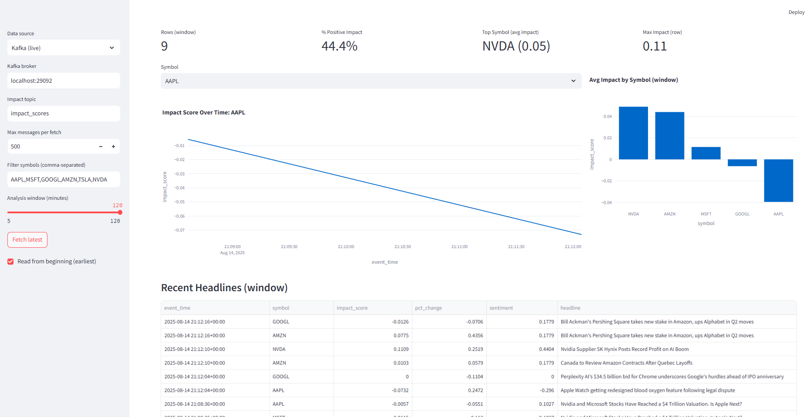

```markdown
# News Impact Tracker

A real-time pipeline that ingests breaking financial news, calculates sentiment-driven price impacts for selected stocks, and visualizes the results in an interactive dashboard.

## Features
- Real-time data ingestion from multiple financial news RSS feeds
- Live price streaming for selected tickers
- Sentiment analysis (VADER) on news headlines
- Impact score calculation = sentiment × short-term price change
- Kafka-powered message streaming between components
- Interactive Streamlit dashboard for live monitoring
- Configurable tickers, analysis windows, and news sources

## Prerequisites
- Docker & Docker Compose
- Python 3.9+
- Virtual environment (recommended)


### 1. Clone the repo
```bash
git clone https://github.com/landon-bragg/news-impact-tracker.git
cd news-impact-tracker
````

### 2. Start Kafka & dependencies

```powershell
docker compose up -d
docker inspect -f "{{.State.Health.Status}}" kafka
```

### 3. Create & activate a virtual environment

```powershell
python -m venv .venv
& .\.venv\Scripts\Activate.ps1
pip install -r requirements.txt
```

### 4. Configure environment variables

Copy `.env.example` → `.env` and adjust:

```env
KAFKA_BROKER=localhost:29092
SYMBOLS=AAPL,MSFT,GOOGL,AMZN,TSLA,NVDA
KAFKA_TOPIC_NEWS=news_headlines
KAFKA_TOPIC_PRICES=price_ticks
KAFKA_TOPIC_IMPACT=impact_scores
```

## ▶️ Running the Pipeline

Open three separate terminals (all with the venv activated):

**A) Price producer**

```powershell
$env:KAFKA_BROKER="localhost:29092"
python .\producers\price_producer\app.py
```

**B) News producer**

```powershell
$env:KAFKA_BROKER="localhost:29092"
$env:SYMBOLS="AAPL,MSFT,GOOGL,AMZN,TSLA,NVDA"
python .\producers\news_producer\app.py
```

**C) Impact calculator**

```powershell
$env:KAFKA_BROKER="localhost:29092"
$env:KAFKA_TOPIC_NEWS="news_headlines"
$env:KAFKA_TOPIC_PRICES="price_ticks"
$env:KAFKA_TOPIC_IMPACT="impact_scores"
python .\simple_impact_calculator.py
```

## Viewing the Dashboard

Run the live dashboard:

```powershell
$env:KAFKA_BROKER="localhost:29092"
$env:KAFKA_TOPIC_IMPACT="impact_scores"
streamlit run .\dashboard\app.py
```

Open your browser at:

```
http://localhost:8501
```


## 📝 Customization

* **Add/remove tickers:** Edit `SYMBOLS` in `.env` or when starting producers.
* **Change feeds:** Modify the RSS list in `producers/news_producer/app.py`.
* **Adjust impact formula:** Edit `simple_impact_calculator.py`.

